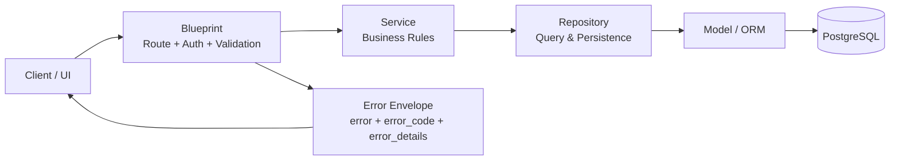

# 架構與責任邊界（Architecture & Ownership）

> 更新日期：2026-05-08  
> 目的：用一份文件清楚說明系統分層、責任歸屬與變更原則。

---

## 1. 系統分層（Backend）

標準路徑：

`Blueprint(Route) -> Service(Business Rule) -> Repository(Query) -> Model(ORM)`

### 架構圖（Mermaid）



### 各層責任

- **Blueprint**
  - 路由定義、JWT 與權限 decorator 接線
  - request payload 驗證（`validate_payload_or_400`）
  - 回應格式轉換（統一 error envelope）
- **Service**
  - 業務規則、流程編排、跨 repository 邏輯
  - 不直接承擔複雜 SQL / 查詢拼接
- **Repository**
  - 查詢、關聯讀寫、資料存取細節
  - 提供 service 可重用的資料操作介面
- **Model**
  - ORM schema 與關聯
  - 不放業務流程分支

---

## 2. 系統分層（Frontend）

建議路徑：

`View(UI Flow) -> Store(State) -> Service(API) -> Utils/Types(契約與共用邏輯)`

### 各層責任

- **View**
  - 頁面流程與互動狀態
  - 不直接寫重複的 API 錯誤解析
- **Store**
  - 可重用的狀態管理與行為封裝
- **Service**
  - API 呼叫、參數整形、回應型別
- **Utils / Types**
  - 共用函式與契約（例如 `apiError.ts`、payload mapper）

---

## 3. 錯誤契約邊界

後端統一錯誤回應：

```json
{
  "error": "人類可讀訊息",
  "error_code": "VALIDATION_ERROR",
  "error_details": {}
}
```

前端規則：

- 流程判斷優先依 `error_code`
- 文案顯示優先 `error`，無則 fallback 映射
- `UNAUTHORIZED` 走 refresh/login flow

---

## 4. 變更原則（避免邊界退化）

1. 新增 API 時，先決定各層責任，再動手寫。  
2. Service 若出現大量 query，優先下沉到 Repository。  
3. View 若開始重複錯誤處理或 payload 組裝，抽到 Utils。  
4. 契約變更先改 Types/Docs，再改呼叫端。  
5. 重構預設「不改行為」，先做可驗證的小步提交。

---

## 5. 實作重點摘要

- 後端已統一為 `Blueprint -> Service -> Repository`，可降低耦合與測試難度。  
- 錯誤回應已收斂為 `error_code` 契約，前端流程判斷不再依賴訊息字串。  
- 在不新增功能的情況下持續做結構收斂（例如把大型元件純函式抽到 utils），維持行為一致並降低維護成本。
