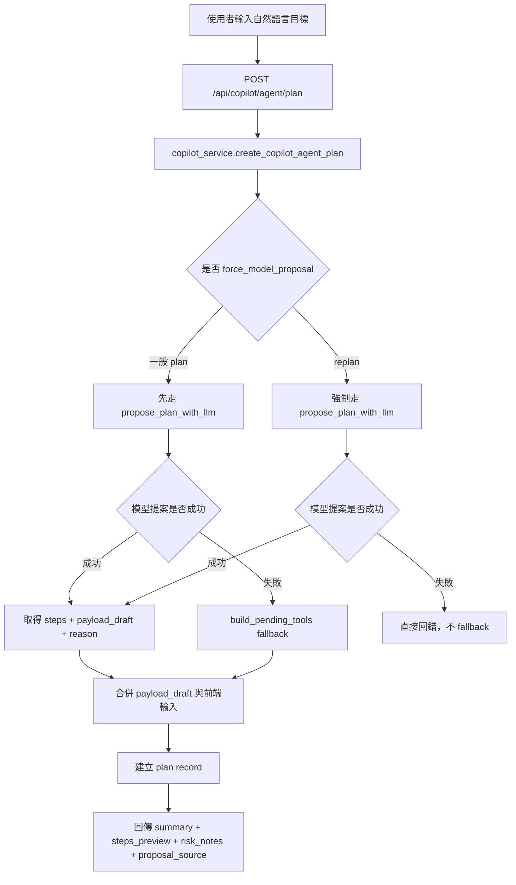
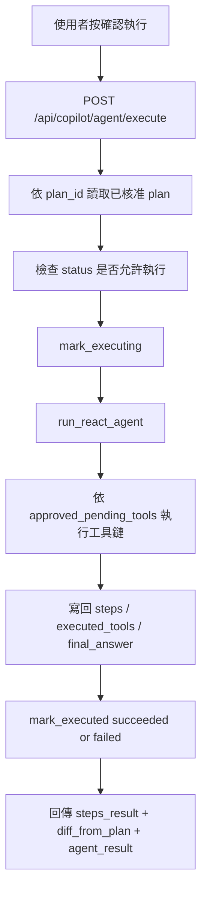

# Phase 9.3 ~ 9.5 Agent 總整理

> 日期：2026-06-04  
> 用途：把 Phase 9.3、9.4、9.5 已經做完的內容收斂成一份「現在到底有什麼、怎麼運作、還缺什麼」的說明，方便後續回看與進入 9.6。

---

## 1. 先講結論

這三個 phase 做完後，目前後端已經不是單純的「AI 幫你直接呼叫函式」而已，而是變成一個有明確邊界的 agent 系統：

1. 9.3：先把一部分 service 入口包成可控的 tools，並接到 LangGraph。
2. 9.4：再把直接執行改成雙階段流程，先產生 plan，使用者確認後才執行。
3. 9.5：再把 plan 階段升級成「模型提案為主、規則 fallback」，讓較複雜需求不再只靠關鍵詞選工具。

一句話版：

`9.3 = 能跑的 agent`
`9.4 = 可確認後再跑的 agent`
`9.5 = 會先提案、被確認後才跑的 agent`

---

## 2. 為什麼要拆成 9.3、9.4、9.5

這三步不是重做三次，而是在同一條主線上逐步加安全性與可控性。

### 9.3 要解決的事

9.3 的核心問題是：

- 現有 service 雖然能做很多事，但模型不能直接亂碰。
- 需要一層白名單，把「可給 agent 用的函式」挑出來。
- 需要統一輸入輸出格式，不能每個函式各回各的。

所以 9.3 的本質是：

- 建 tool registry
- 建 tool schema
- 建 tool error envelope
- 建 LangGraph 最小閉環

### 9.4 要解決的事

9.3 雖然已經能執行，但有一個問題：

- 使用者一句話送進去，agent 就直接做了。

這對查詢類功能還好，但對建立/修改/批次寫入類功能風險太高。

所以 9.4 把流程改成：

- 先規劃
- 再確認
- 再執行

也就是：

`Plan -> Confirm -> Execute`

### 9.5 要解決的事

9.4 的 plan 雖然安全了，但一開始的 plan 邏輯仍主要依賴 `build_pending_tools()` 裡的關鍵詞規則。

這在簡單場景可以，但一旦需求變複雜，就會開始不夠彈性。

所以 9.5 把 plan 階段升級成：

- 預設用模型讀工具清單與註解來提案
- 如果提案失敗，再 fallback 到規則
- 如果是 replan，則強制再次用模型提案，不可默默回退

---

## 3. 現在的整體架構

目前可以把系統拆成四層來理解：

1. Tool 契約層
2. Tool Registry / Handler 層
3. Agent 流程層
4. Copilot API / 前端互動層

### 3.1 Tool 契約層

目標：把「工具能吃什麼、回什麼、錯了怎麼表示」固定下來。

主要檔案：

- `backend/services/contracts/tool_inputs.py`
- `backend/services/contracts/tool_outputs.py`
- `backend/services/contracts/tool_envelopes.py`

這層做的事：

1. 定義每個 tool 的輸入 schema。
2. 定義每個 tool 的成功輸出形狀。
3. 定義統一錯誤 envelope：
   - `error_code`
   - `message`
   - `retryable`
   - `hint`

你可以把這層理解成：

「先把模型能碰的 API 契約硬化」

---

### 3.2 Tool Registry / Handler 層

目標：只暴露白名單工具，禁止 agent 直接碰 service 內部 helper。

主要檔案：

- `backend/services/tools/registry.py`
- `backend/services/tools/handlers.py`
- `backend/services/tools/error_mapper.py`

#### `registry.py` 在做什麼

它像是一份「工具清單」。

每個 tool 都有：

1. `name`
2. `description`
3. `input_model`
4. `handler`
5. `side_effects`
6. `side_effect_level`
7. `user_visible_label`
8. `requires_confirmation`
9. `permission_note`

這代表 registry 不只是註冊函式而已，它還順便提供：

1. 給模型看的描述
2. 給前端 plan 預覽用的人類可讀名稱
3. 給風險標註用的副作用資訊

#### `handlers.py` 在做什麼

handler 的角色不是重新實作商業邏輯，而是：

1. 驗證輸入
2. 呼叫 service
3. 把回傳包成統一 envelope
4. 把 service error 映射成 agent 可理解的錯誤語意

所以 handler 比較像「tool adapter」。

---

### 3.3 Agent 流程層

目標：讓工具不是只呼叫一次，而是能根據上下文依序做多步流程。

主要檔案：

- `backend/chains/agent_state.py`
- `backend/chains/agent_nodes.py`
- `backend/chains/agent_graph.py`

#### `agent_state.py`

定義整個 agent 在一次執行中的共享狀態，例如：

1. `user_message`
2. `context`
3. `pending_tools`
4. `executed_tools`
5. `steps`
6. `last_error`
7. `route`

#### `agent_nodes.py`

這是目前最重要的流程檔。

它裡面主要有幾件事：

1. `build_pending_tools()`
   - 規則式工具挑選器
   - 依關鍵詞快速組出候選工具序列

2. `_build_payload()`
   - 根據 `context + tool_payloads + state` 組出實際要給工具的 payload

3. `intent_parse_node()`
   - 判斷需求是否支援
   - 決定是否先建立 `pending_tools`

4. `tool_select_node()`
   - 檢查下一步要不要繼續跑

5. `tool_execute_node()`
   - 執行目前工具
   - 把結果寫回 `steps`

6. `route_by_error_node()`
   - 依 `error_code/retryable` 決定是 retry、ask_user 還是 stop

7. `finalize_node()`
   - 產生最後給使用者看的回答

#### `agent_graph.py`

把這些 nodes 串成 LangGraph 的執行流程。

---

### 3.4 Copilot API / 前端互動層

目標：把 agent 變成前端可實際使用的功能，而不是只有後端流程。

主要檔案：

- `backend/blueprints/copilot.py`
- `backend/services/copilot_service.py`
- `backend/services/agent_plan_service.py`
- `frontend/src/components/CopilotDock.vue`
- `frontend/src/services/copilotService.ts`
- `frontend/src/types/copilot.ts`

#### `copilot_service.py`

這支現在等於是整個 Copilot Agent 的 orchestration service。

它負責三條線：

1. 舊 MCP 路線
   - `execute_copilot_mcp_request()`

2. Agent plan / confirm / execute 路線
   - `create_copilot_agent_plan()`
   - `reject_copilot_agent_plan()`
   - `execute_copilot_agent_plan()`
   - `execute_copilot_agent_request()`

3. 9.5 的模型提案路線
   - `_propose_pending_tools()`
   - `_merge_tool_payloads()`
   - `proposal_source / proposal_reason`

#### `agent_plan_service.py`

它是目前的 in-memory plan store。

目前管理：

1. `plan_id`
2. `status`
3. `goal`
4. `context`
5. `approved_tool_payloads`
6. `pending_tools`
7. `summary`
8. `steps_preview`
9. `risk_notes`
10. `proposal_source`
11. `proposal_reason`
12. `execution_id`
13. `expires_at`

也就是說，9.4 之後的 plan 已經不是前端暫存而已，而是後端有一份正式快照。

#### `CopilotDock.vue`

前端現在有一個全域入口。

目前功能重點：

1. 使用者輸入自然語言目標
2. 前端只送 message，不讓使用者自己填工具參數
3. context 由系統自動帶入
4. 先顯示 plan 預覽
5. 再讓使用者按確認執行
6. 顯示提案來源與提案說明

這點很重要：

前端現在的設計方向已經不是「把工具參數攤給使用者填」，而是「讓使用者只描述目標」。

---

## 4. 9.3、9.4、9.5 分別實際落地了什麼

## 4.1 Phase 9.3 實際落地

9.3 真正做完的，不是「所有函式都變成 tools」，而是：

1. 先挑出第一批高價值工具做白名單化。
2. 把這些工具接到 LangGraph。
3. 建出最小可跑的 ReAct 閉環。

目前 registry 內的主要工具包括：

1. `create_task_for_user`
2. `update_task_for_member`
3. `list_tasks_for_user`
4. `generate_timeline_tasks_with_ai`
5. `create_timeline_for_user`
6. `batch_create_tasks_for_timeline`
7. `check_timeline_task_conflicts`
8. `generate_group_snapshot`
9. `upload_and_index_knowledge_document`
10. `list_knowledge_documents`
11. `summarize_task_comments_for_member`

這代表 9.3 的核心成果是：

- agent 已經可以做部分多步流程
- 不是直接 call service，而是經過 registry + handler + envelope

### 9.3 的邊界

還沒做到的事：

1. 不是所有 service 對外函式都已 tool 化
2. 還沒有評測基線
3. 還沒有完整 trace
4. 還沒有持久化 plan store

---

## 4.2 Phase 9.4 實際落地

9.4 之後，agent 不再是：

`輸入一句話 -> 直接執行`

而是：

`輸入一句話 -> 產生 plan -> 使用者確認 -> 再執行`

### 9.4 的核心改變

1. 新增 `plan / reject / replan / execute` API
2. 新增 plan store
3. 執行階段只能跑已核准的 `plan_id`
4. execute 不接受臨時覆寫 `tool_payloads`
5. 前端新增計畫預覽面板

### 這樣帶來的效果

1. 寫入類操作不再是黑箱
2. 使用者能先看到系統打算做什麼
3. preview 和 execute 的資料一致性更高

---

## 4.3 Phase 9.5 實際落地

9.5 不是重寫 agent，而是把 9.4 的 plan 階段升級。

### 升級前

plan 主要來自 `build_pending_tools()`：

- 根據關鍵詞
- 直接產生工具序列

### 升級後

現在是：

1. 先把目前註冊的 tools 轉成模型可讀的清單
2. 清單中包含：
   - 名稱
   - 描述
   - side effect
   - permission note
   - input schema
3. 讓模型輸出一份 proposal JSON
4. 後端驗證 proposal
5. 若 proposal 失敗，plan 可 fallback 到 `build_pending_tools()`
6. 若是 `replan`，則不允許 fallback，必須重新模型提案

### 9.5 多了哪些欄位

plan record / plan API 現在會回：

1. `proposal_source`
   - `llm_proposal`
   - `rule_fallback`

2. `proposal_reason`
   - 為什麼這樣規劃
   - 或為什麼 fallback

這對之後 9.6 很重要，因為它已經開始具備可觀測性欄位的雛形。

---

## 5. 現在實際執行流程怎麼跑

## 5.1 Plan 流程

### Plan 的關鍵點

1. `payload_draft` 只是在 plan 階段先草擬，不代表可以覆寫敏感欄位。
2. `summary` 和 `steps_preview` 會轉成使用者可讀文字。
3. `proposal_source` 讓你知道這份 plan 是模型提案還是規則回退。

---

## 5.2 Execute 流程

### Execute 的關鍵點

1. execute 階段不允許重新塞新的 `tool_payloads`。
2. 實際執行仍是走 LangGraph 的 tool loop。
3. `approved_pending_tools` 來自已核准的 plan snapshot，而不是 execute 當下重新猜。

---

## 6. `build_pending_tools()` 現在到底是什麼角色

這個地方最容易混淆，所以單獨講。

### 在 9.3

它原本就是主要的工具挑選器。

也就是：

- 看關鍵詞
- 回傳對應工具序列

### 在 9.5 之後

它不再是主路徑，而是：

1. `plan` 的 fallback
2. 某些高信心簡單需求的快速規則路徑
3. agent 在缺少模型提案時的保底邏輯

所以目前狀態是：

- 有保留
- 但定位已經降級
- 不是最終長期答案

如果之後要往更完整的 agent 發展，`build_pending_tools()` 比較像：

「保底規則層」

而不是：

「真正的規劃器」

---

## 7. 現在有哪些安全邊界

這三個 phase 其實做了很多安全邊界，不只是 UX。

### 7.1 工具白名單

只有 registry 內註冊的工具能被 agent 用。

### 7.2 敏感欄位不可由外部覆寫

目前保護欄位包括：

1. `user_id`
2. `actor_user_id`
3. `created_by`
4. `timeline_id`
5. `task_id`
6. `group_id`

也就是說，前端與模型都不能任意改這些欄位。

### 7.3 confirm 才能寫入

所有高副作用步驟都要先經過 plan 與使用者確認。

### 7.4 execute 不可覆寫 plan

這是 9.4 修得很關鍵的一點。

否則就會出現：

- 使用者看到的是 A 計畫
- 實際執行的是 B 參數

現在這條已經被鎖住。

### 7.5 replan 必須重新提案與重新確認

replan 不可沿用舊 plan 直接改改就執行。

現在規則是：

1. 重提案
2. 產生新 `plan_id`
3. 再次 confirm

---

## 8. 前端目前使用者會看到什麼

使用者目前看到的，不是函式名與內部參數，而是：

1. 目標輸入框
2. 自動帶入的 context 提示
3. 計畫摘要
4. 預計步驟
5. 風險提示
6. 提案來源
7. 提案理由
8. 確認執行 / 取消計畫
9. 執行結果與每步成功失敗

這點很重要，因為系統現在的方向已經很明確：

- 前端不讓使用者直接填工具參數
- 前端只讓使用者描述目標
- 內部路由與工具組合由後端 agent 決定

---

## 9. 目前還沒做的，不要誤以為已經有

這份是特別拿來避免高估現況的。

目前還沒有：

1. 完整 tool 覆蓋
   - 還不是所有 service 對外函式都已註冊成 tool

2. 真正完整的模型規劃器
   - 9.5 的模型提案主要是在 plan 階段提案 steps
   - execute 階段本身仍主要依核准快照跑既有 loop

3. 持久化 plan store
   - 目前是 in-memory
   - 重啟後會消失

4. 完整 trace / request_id / benchmark
   - 這是 9.6 要做的重點

5. 補償回滾 / saga
   - 目前沒有做 undo 流程
   - 現在策略是「先確認，再執行」

6. 全部場景的高品質 tool chaining
   - 現在還是第一批白名單為主

---

## 10. 如果把現在系統一句話講清楚

目前的 Copilot Agent 可以這樣理解：

「一個以單體後端為核心、透過白名單工具與 LangGraph 執行、在真正寫入前先產生可確認計畫，並且在複雜需求下優先使用模型提案工具序列的 agent 初版。」

---

## 11. 你現在最值得記住的三件事

1. 9.3 做的是「把 service 入口變成可控 tools，並讓 agent 能跑」。
2. 9.4 做的是「把直接執行改成先 plan 再 confirm」。
3. 9.5 做的是「把 plan 從關鍵詞規則升級成模型提案優先，但仍保留 fallback」。

---

## 12. 下一步自然會接到哪裡

最自然的下一步就是 9.6，因為現在我們已經有：

1. tools
2. agent loop
3. plan store
4. plan source
5. plan reason
6. 執行結果

接下來缺的是：

1. trace
2. request_id
3. benchmark 題集
4. benchmark runner
5. 成功率 / 耗時 / route 報表

也就是說，9.6 不是跳題，而是把 9.3~9.5 這套系統變得「可量測」。

