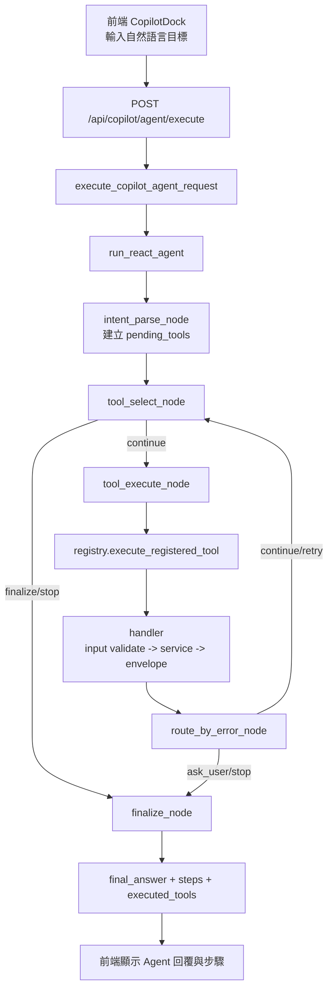

# Phase 9.3 詳細解釋：單體 Tool Registry + LangGraph ReAct Agent

> 日期：2026-05-31  
> 狀態：首版已落地（可用，但尚未全覆蓋全部 service 函式）  
> 對象：未來維護者、你自己回顧時快速定位

---

## 1. 9.3 到底做了什麼（先講結論）

Phase 9.3 不是「完整萬能 agent」，而是先把最小可用主線打通：

1. 建立一層單體 `Tool Registry`（白名單），避免 agent 亂呼叫內部 helper。
2. 每個工具透過 `handler` 做輸入驗證、轉調 service、輸出統一 envelope。
3. 用 `LangGraph` 串起 `intent -> select -> execute -> route -> finalize` 的循環。
4. 前端提供全域入口（右下角 Copilot 面板）呼叫新 agent API。

---

## 2. 目前能力邊界（很重要）

### 已做到

1. 支援多步工具流程（例如建立專案 -> AI 生成任務 -> 批次建立任務）。
2. 支援依賴鍊任務寫入（沿用既有 `timeline_service` 的依賴解析與 fallback）。
3. 支援統一錯誤語意（`error_code/retryable/hint`）。

### 尚未做到

1. 尚未把全部 service 對外函式都納入 tool 白名單。
2. tool selection 仍是規則導向（keyword/rule），還不是完整語意規劃器。
3. 流程測試是「關鍵場景 smoke test」，不是所有組合全覆蓋。

---

## 3. 檔案地圖：每個檔案在 9.3 的角色

## 3.1 Contracts（工具契約層）

1. `backend/services/contracts/tool_envelopes.py`
: 定義統一回傳外殼。
- 成功：`{ ok: true, data: ... }`
- 失敗：`{ ok: false, error: { error_code, message, retryable, hint } }`

2. `backend/services/contracts/tool_inputs.py`
: 定義每個工具的輸入 schema（Pydantic）。

3. `backend/services/contracts/tool_outputs.py`
: 定義每個工具的成功輸出資料形狀（Pydantic）。

## 3.2 Tools（工具執行層）

1. `backend/services/tools/handlers.py`
: 單工具轉接器。  
做四件事：`驗證輸入 -> 呼叫 service -> 包成功 envelope -> 包錯誤 envelope`。

2. `backend/services/tools/registry.py`
: 工具白名單。  
只註冊允許給 agent 調用的工具，並管理描述、副作用、權限提示、input schema。

3. `backend/services/tools/error_mapper.py`
: 把各 service 例外映射到標準 `error_code`，並決定是否可重試。

## 3.3 Agent（LangGraph 編排層）

1. `backend/chains/agent_state.py`
: 定義 agent state 欄位（message/context/steps/error/retry/loop 等）。

2. `backend/chains/agent_nodes.py`
: 各節點邏輯（intent parse、payload 構建、tool 執行、錯誤路由、完成判定）。

3. `backend/chains/agent_graph.py`
: 組圖（StateGraph），串接節點與條件路由，輸出 `run_react_agent()`。

## 3.4 API 與前端入口

1. `backend/blueprints/copilot.py`
- `POST /api/copilot/agent/execute`
- `GET /api/copilot/agent/tools`
- 並保留既有 MCP 路徑（相容）

2. `frontend/src/components/CopilotDock.vue`
: 右下角全域入口。使用者只輸入目標文字，context 由系統自動帶入（含 JWT user_id 注入）。

---

## 4. 9.3 流程圖（Mermaid）

---

## 5. 典型案例：建立專案 + 依賴鍊任務

輸入：
`幫我創建一個叫做agent測試的專案，並且幫我創建對應的任務，記得要有依賴鍊`

目前會走：

1. `create_timeline_for_user`
2. `generate_timeline_tasks_with_ai`
3. `batch_create_tasks_for_timeline`

依賴鍊如何成立：

1. AI 若有輸出 `depends_on_task_ids/depends_on_task_refs` -> 直接使用
2. 若 AI 沒給依賴 -> 既有正規化邏輯會以生成順序補鏈（fallback）

---

## 6. 為什麼看起來像「很快就完成」

在資料量小、上下文短時，這條流程只要：

1. 少量 DB 寫入
2. 一次 AI 生成
3. 一次批次任務寫入

所以 3~5 秒完成屬正常。

---

## 7. 為什麼不是「全函式都做成 tool」

這是刻意設計：

1. 避免 agent 誤用低階 helper（不可控副作用）。
2. 先建立穩定高語意入口，再逐步擴充。
3. 降低測試組合爆炸，先保關鍵場景可用。

---

## 8. 下一步建議（9.3 後續）

1. 擴充白名單工具（timeline/group/knowledge/profile 其餘入口）。
2. 增加可觀測欄位（每步 route/error_code/retry_count trace）。
3. 補關鍵 smoke scenarios（至少 5~8 條常見任務鏈）。
4. 規劃 9.4：把 rule-based selection 逐步升級為更穩定的 planner 策略。
