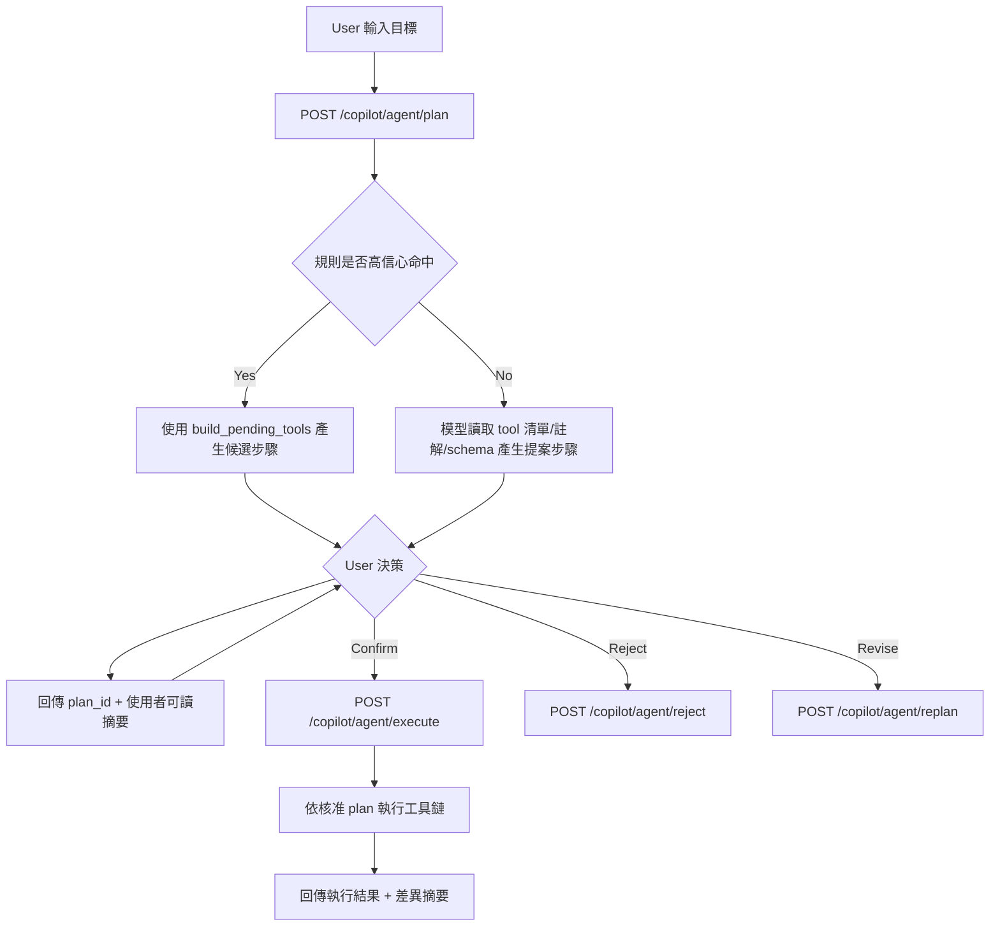

# Phase 9.4：Agent 雙階段執行（Plan → Confirm → Execute）規劃

> 日期：2026-05-31  
> 階段定位：Phase 9 第四階段（把 9.3 的可執行 agent 升級為「可確認後執行」）  
> 前置條件：9.3 已完成（單體 tool registry + LangGraph 最小閉環）

---

## 為什麼改成雙階段

本階段主軸改為「先規劃、再確認、最後執行」，不走「先執行再回滾」。

這樣做的原因：

1. 降低工程複雜度：暫時不需要完整 undo/saga。
2. 提升可控性：使用者先看懂 agent 打算做什麼，再決定是否執行。
3. 避免不可逆風險：在執行前就把不合理步驟攔掉。
4. 更符合目前單體專案節奏：先做穩定可用，再擴展可逆機制。

---

## 目標（9.4 Done 定義）

1. 使用者輸入自然語言需求後，先拿到「執行計畫摘要（不落 DB）」。
2. 使用者確認後，系統才依核准計畫執行工具鏈。
3. 使用者拒絕時，流程直接結束且不產生寫入副作用。
4. 執行結果要回傳「預期 vs 實際」，可追蹤差異。
5. 前端有清楚的兩段式 UX：規劃結果、確認按鈕、執行結果。

---

## 非目標（本階段刻意不做）

1. 不做完整補償回滾（rollback/undo saga）。
2. 不處理跨服務分散式交易。
3. 不處理 MCP 遠端工具一致性。
4. 不一次覆蓋所有 tool（先覆蓋高價值場景）。

---

## 核心模型

> 2026-06-02 對齊補充：  
> 9.4 後續採「**規則路由保留 + 模型提案為主**」雙軌。  
> `build_pending_tools` 不移除，作為高信心快速路徑與 fallback；主流程改由模型根據 tool 註解與 schema 先產生 plan，再交由使用者確認。

### Phase A：Plan（只規劃，不執行）

- 輸入：`goal + context`
- 輸出：`plan_id + steps + user_facing_summary + risk_notes`
- 特性：
  - 不落資料庫實體變更
  - 允許模型重排步驟與補齊前置依賴
  - 只給使用者可理解敘述，不暴露底層函式細節
  - 模型只擁有「提案權」，不擁有「執行權」
  - 規則路由（`build_pending_tools`）作為 fallback，不直接取代模型提案主路徑

### Phase B：Confirm

- 使用者操作：
  - `confirm`：進入執行
  - `reject`：終止，或要求重新規劃
  - `reject + feedback`：攜帶修正要求進入 `replan`

#### Replan 強制規則（對齊決策）

當使用者拒絕（reject）並要求重新規劃時，**必須**走以下流程，不可沿用舊 plan 直接執行：

1. 後端重新整理可用 `tool list`（白名單 + 註解 + input schema）。
2. 將「原始需求 + 使用者補充修正 + tool list」交給模型重新提案。
3. 模型只回傳 `steps/payload 草案`（提案權），不得直接執行工具。
4. 後端做白名單與 schema 驗證，產生新 `plan_id`。
5. 前端顯示新 plan，**使用者再次確認（confirm）後**才可進入 execute。

一句話規則：
`replan = 重新給模型讀 tool list 並重選步驟 -> 使用者再次確認 -> 才執行`

### Phase C：Execute（正式執行）

- 僅執行已核准的 `plan_id`
- 回傳：
  - `success_steps`
  - `failed_step`（若失敗）
  - `execution_summary`
  - `diff_from_plan`（預期與實際差異）
 - 規則：
   - execute 不接受模型當下自由改參數
   - execute 不接受前端臨時覆寫敏感欄位

---

## 流程圖（Mermaid）



---

## 狀態機（建議）

`planned -> confirmed -> executing -> succeeded | failed | rejected | expired`

- `planned`：已產生計畫，等待使用者回覆
- `confirmed`：收到確認，等待進入執行
- `executing`：執行中
- `succeeded`：全步驟成功
- `failed`：中途失敗（本階段先不做自動 rollback）
- `rejected`：使用者拒絕
- `expired`：超過可確認時效

---

## API 契約草案

### 1) `POST /copilot/agent/plan`

Request（概念）：

```json
{
  "goal": "幫我建立專案並生成任務依賴",
  "context": {
    "user_id": 1
  }
}
```

Response（概念）：

```json
{
  "ok": true,
  "plan_id": "plan_20260531_xxx",
  "expires_at": "2026-05-31T13:30:00Z",
  "summary": "將先建立專案，再生成任務草案，最後補上依賴關係。",
  "steps_preview": [
    "建立新專案",
    "依需求生成任務清單",
    "設定任務前後依賴"
  ],
  "risk_notes": [
    "將新增專案與任務資料",
    "若需求描述不完整，任務名稱可能需人工微調"
  ]
}
```

### 2) `POST /copilot/agent/execute`

Request（概念）：

```json
{
  "plan_id": "plan_20260531_xxx",
  "confirm": true
}
```

Response（概念）：

```json
{
  "ok": true,
  "execution_id": "exec_20260531_xxx",
  "status": "succeeded",
  "summary": "已建立 1 個專案、6 個任務，並完成依賴鏈設定。",
  "diff_from_plan": [],
  "steps_result": [
    { "seq": 1, "status": "success" },
    { "seq": 2, "status": "success" },
    { "seq": 3, "status": "success" }
  ]
}
```

### 3) `POST /copilot/agent/reject`

Request（概念）：

```json
{
  "plan_id": "plan_20260531_xxx",
  "reason": "先不要建立，請縮小範圍"
}
```

Response（概念）：

```json
{
  "ok": true,
  "status": "rejected"
}
```

### 4) `POST /copilot/agent/replan`（可選）

- 給使用者「調整要求」後重產 plan。
- 行為契約（強制）：
  1. 重新把 tool list 提供給模型做新提案
  2. 產生新 `plan_id`（不可覆寫舊 `plan_id`）
  3. 新 plan 仍需使用者 confirm，不能直接 execute

---

## 後端檔案規劃（9.4）

1. `backend/chains/agent_state.py`
- 新增欄位：
  - `phase: "plan" | "execute"`
  - `plan_id`
  - `approved_plan_snapshot`

2. `backend/chains/agent_nodes.py`
- 新增：
  - `plan_node`（只產生步驟與摘要）
  - `execute_node`（僅執行核准計畫）
- 執行時禁止模型臨時偏離已核准步驟（允許有限度參數補齊，但需記錄差異）。
 - 保留 `build_pending_tools`，作為規則 fallback；新增「模型提案 orchestrator」入口。

3. `backend/services/tools/registry.py`
- 補 metadata（不是為了 rollback，而是為了規劃品質）：
  - `user_visible_label`
  - `side_effect_level`
  - `requires_confirmation`

4. `backend/services/agent_plan_service.py`（新）
- 管理 `plan_id`、狀態流轉、TTL、已核准快照。
 - 保存 `approved_pending_tools` 與 `approved_tool_payloads`（sanitized）。

5. `backend/blueprints/copilot.py`
- 新增或改造 API：
  - `POST /copilot/agent/plan`
  - `POST /copilot/agent/execute`
  - `POST /copilot/agent/reject`
  - `POST /copilot/agent/replan`（可選）

---

## 前端檔案規劃（9.4）

1. `frontend/src/components/CopilotDock.vue`
- 新增兩段式 UI：
  - 區塊 A：計畫預覽（摘要、步驟、風險）
  - 區塊 B：確認執行與結果展示
- 按鈕：
  - `確認執行`
  - `重新規劃`
  - `取消`

2. `frontend/src/services/copilotService.ts`
- 新增 plan/execute/reject/replan 對應方法。

3. `frontend/src/types/copilot.ts`
- 新增 `PlanResponse`、`ExecuteResponse`、`PlanStatus`。

---

## 錯誤矩陣（agent 路由語意）

1. `PLAN_EXPIRED`
- 行為：提示重新規劃

2. `PLAN_NOT_FOUND`
- 行為：中止並提示重新送出需求

3. `PLAN_NOT_CONFIRMED`
- 行為：拒絕執行，要求先確認

4. `EXECUTION_STEP_FAILED`
- 行為：回傳失敗步驟與建議（本階段先不自動 rollback）

5. `VALIDATION_ERROR`
- 行為：要求使用者補充資訊後 replan

---

## 測試策略（9.4）

1. `plan` 契約測試
- 只回傳計畫、不產生寫入副作用。

2. `plan -> execute` smoke tests
- confirm 後成功執行。

3. `plan -> reject` smoke tests
- reject 後不可再 execute（除非 replan）。

4. `expired plan` 測試
- 超時 plan 無法 execute。

5. 冪等測試
- 同一 `plan_id` 重複 execute 不重複寫入（或明確拒絕第二次）。

---

## 實作分段建議（可直接開工）

### Wave 1（最小可用）

1. 後端：`plan / execute / reject` API 打通。
2. 前端：`CopilotDock` 顯示 plan 並可 confirm。
3. 測試：至少 2 條成功場景 + 2 條失敗場景。

### Wave 2（穩定化）

1. 加入 `replan`。
2. 補 `diff_from_plan` 顯示。
3. 增加 plan TTL 與過期處理 UX。
4. 導入「模型提案為主，規則路由 fallback」：  
   - 模型讀 tool 註解與 schema 產生 steps/payload 草案  
   - 後端白名單與 schema 驗證後入 plan
5. 明確落地 replan 契約：  
   - reject 後一律重新餵 tool list 給模型  
   - 新 plan 必須二次確認，禁止跳過 confirm 直執行

### Wave 3（下一階段銜接）

1. 再評估是否引入局部補償回滾（只針對高風險工具）。

---

## 與昨天版本差異（對齊說明）

昨天版本偏向 `preview + commit + rollback`（Saga 思路）。  
本版改為 `plan + confirm + execute`，先避開 rollback 工程複雜度。

保留共同點：

1. 都是先讓使用者確認再落地。
2. 都要求可追蹤的 operation/plan 記錄。
3. 都強調前端要顯示可理解摘要而非底層函式細節。

---

## 與 9.3 的關係

9.3 解決「agent 能執行」。  
9.4 解決「agent 執行前可確認，流程可控」，並將決策升級為「模型提案 + 規則 fallback」雙軌。

這是從可用 prototype 走向可上線互動體驗的關鍵一步。
